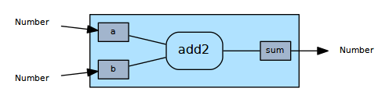
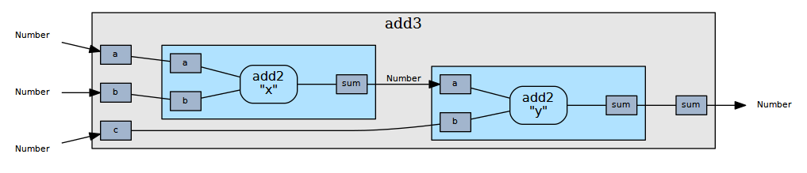

Flow-based Programming
======================

Flow-based programming organizes code into opaque nodes which interact
by receiving data on input ports and producing data on output ports.
FBP separates the concern of transforming data from the concern of
transporting data. A node doesn't care where the data came from or
where it's going, whether that's a database, the UI, or some other
node. This architecture has positive implications for maintenance,
performance, and code reuse.

### Additional reading

- [https://en.wikipedia.org/wiki/Flow-based_programming](https://en.wikipedia.org/wiki/Flow-based_programming)
- [http://www.reactivemanifesto.org/](http://www.reactivemanifesto.org/)


Design
------

A _node_ has input ports and output ports. A _port_ has a name and a
type; the type specifies the type of data consumed or produced by the
port. A node is either an _atomic node_ or a _graph_.

An atomic node contains code that reads from the input ports and
writes to the output ports.



A graph contains a network of connected nodes. Ports not connected
internally are exposed via the graph's ports.



Within the context of a graph, a node has a name and an id. The name
uniquely identifies the node within the graph, and the id is a
globally unique identifier (currently used only for rendering graphs).

A port can be classified as either a _source_ or a _sink_. A source
produces data and a sink consumes data. From an external perspective,
input ports are sinks and output ports are sources. From an internal
perspective, these classifications are flipped.

Connections are allowed only between compatible ports. Two ports are
compatible if one is a source and the other is a sink, and the source
type is assignable to the sink type. (More on types below.)

A source port may be connected to multiple sinks, but a sink may only
be connected to one source. In other words, connections can split data
but not merge it. (Merging can be done via an explicit merge node,
TBD.)


Implementation
--------------

### Node specification

Atomic nodes are specified with `defnode`.

```ex
defnode add2(a: Number, b: Number, outputs: [sum: Number]) do
  emit(sum, a + b)
end
```

Graphs are specified with `defgraph`.

```ex
defgraph add3(inputs: [a: Number, b: Number, c: Number],
              outputs: [sum: Number],
              nodes: [x: add2, y: add2],
              connections: edges do
                this.a -> x.a
                this.b -> x.b
                x.sum -> y.a
                this.c -> y.b
                y.sum -> this.sum
              end)

```

`defnode` and `defgraph` each define a method that returns a node
spec.

### Execution

```ex
Flow.run(add2, args: [a: 1, b: 2])   # => [values: [sum: 3]]
```     

Implementation is in Elixir, using a lightweight process for each
node.

The system

1. starts a process for each atomic node,
2. subscribes sinks to sources, and
3. sends every process a message to indicate that the subscription
   phase is complete.

Next, each process

4. waits to receive one value on each input port,
5. executes its code, passing the input values, and
6. exits.


### Error handling

During the subscription phase, sinks set up
[monitors](http://elixir-lang.org/docs/stable/elixir/Process.html#monitor/1)
on their sources. Thus if a process fails abnormally, its dependents
are notified, causing a cascade of failures which ultimately results
in `Flow.run` reporting the error.


### Types

Since Elixir is dynamically typed, we need to create a basic type
system that allows us to associate types with ports, verify port
compatibility, and validate values against expected types.

There are two kinds of types: basic and generic. There is also a
special `Any` type to which all values belong.

A _basic_ type consists of a name, parent type, and predicate. The
name uniquely identifies the type, the parent is used primarily for
typedef'ing (e.g., CompoundId is a String, but an ordinary String
cannot be used where a CompoundId is required), and the predicate
determines whether a given value is a member of the type. The parent
defaults to `Any` if unspecified.

A _generic_ type is parameterized on another type and does not support
inheritance. Its primary purpose is to support typed collections
(e.g., `Array<CompoundId>`).

Since the primary purpose of generic types is to support arrays and
such arrays are read-only, it makes sense to make generic types
covariant. For example, `Array<CompoundId>` is assignable to
`Array<String>`, but the converse is false.

A macro is provided for creating types for Elixir
[structs](http://elixir-lang.org/getting-started/structs.html), which
simply creates a basic type with an automatically generated predicate.


### Supervision

TBD